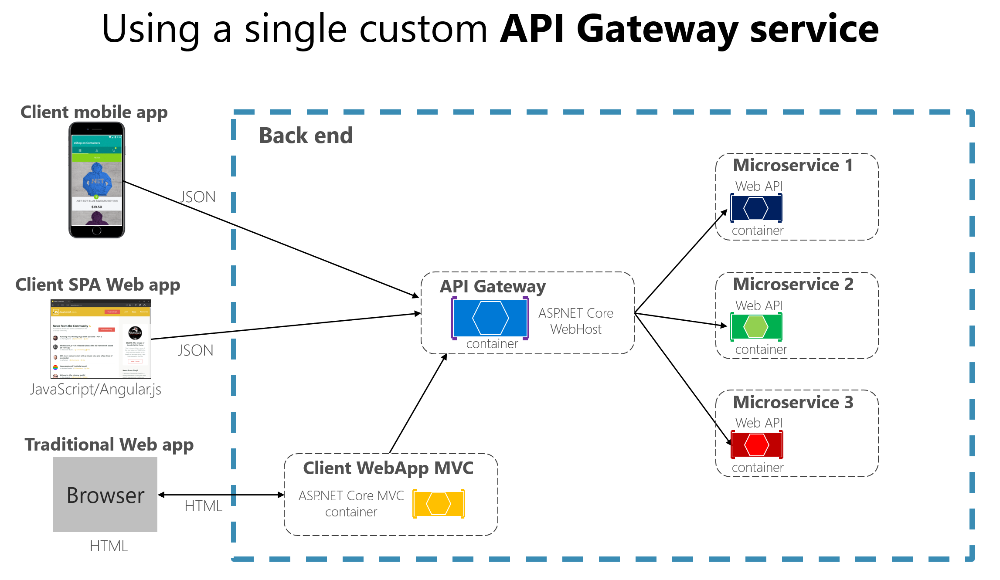

# API Gateway

- [Padrão API Gateway versus comunicação direta de cliente com microsserviço](https://docs.microsoft.com/pt-br/dotnet/architecture/microservices/architect-microservice-container-applications/direct-client-to-microservice-communication-versus-the-api-gateway-pattern)
- [API Gateway Part 1](https://medium.com/easyread/api-gateway-part-1-7901ba703f9)
- [API Gateway Part 2](https://medium.com/easyread/api-gateway-part-2-7264ee5be187)
